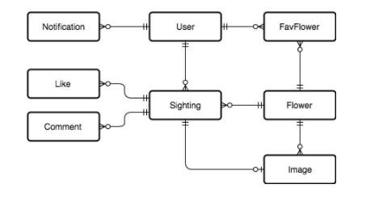

# FlowrSpot API (test build) v.2

## Info

1. This project was build with Ruby 2.3.4 & Rails 5.1.4.
1. Copy .env.sample to .env file and modify if necessary.
1. Modify the database.yml file if needed.
1. Create the database together with the migrations.
1. Run `rake db:test:prepare` and to run `rspec spec` to run the tests (they will fail, read further down the assigment).
1. We are using JWT for Authentication.
1. For tests we have RSpec and a modified file to run Rubocop to check the code.

###############################################################################

Thanks for the great experience, I can't wait for the review of my code...

		----->  for the background job I use cron
		----->	just start bin/setup and it will added automatically